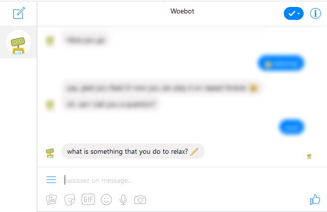

# SMSenger Bridge

## Example




## Prerequisites

- A Twilio account with a static 2-way SMS-enabled phone number (the Account SID and Auth token ready for you to use)
- A Facebook Messenger account

## Install instructions
I assume you know how to download/clone the repository.

First, create a virtualenv at the root of the project. (Optional)
```
cd /project/path/SMSenger-Bridge
virtualenv .
```

Activate the virtualenv (Optional)
```
./Scripts/activate
```

Install the requirements using pip
```
pip install -r requirements.txt
```

Duplicate the `.env.example` file and name it `.env`. Fill all the data in it with yours. _Note: TWILIO_TO_NUMBER is your own cellphone number, not the twilio one_

Finally, run `main.py`
```
python main.py
```

## Setup
Once installed and running...

1. start an ngrok instance on port 5000
2. copy the link it gives you 
3. Go to your twilio SMS webhook (Phone Numbers => Manage Numbers => Active Numbers => your purchased number)
4. Paste the ngrok link + /sms (looks like https://fih3ob.ngrok.io/sms) in the "A MESSAGE COMES IN" field

## Help
For now, the next steps for the project are

1. Make an "SMS Provider" interface for supporting more than twilio as a provider
2. Move the direct client accesses in the listeners to message queues and queue handlers (one for TO_SMS, one for TO_MESSENGER)
3. Find a more elegant way to put the API online than ngrok
4. Find a cheaper SMS provider (with nice APIs available? that'd be rad. I think Amazon SNS supports SMS and is cheaper, might be useful to look into.)
5. Add tests
6. Add CI (Circle CI maybe?) for automatic testing
7. Support group chat
